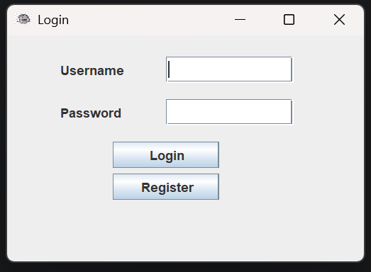
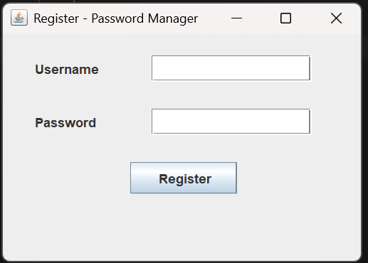
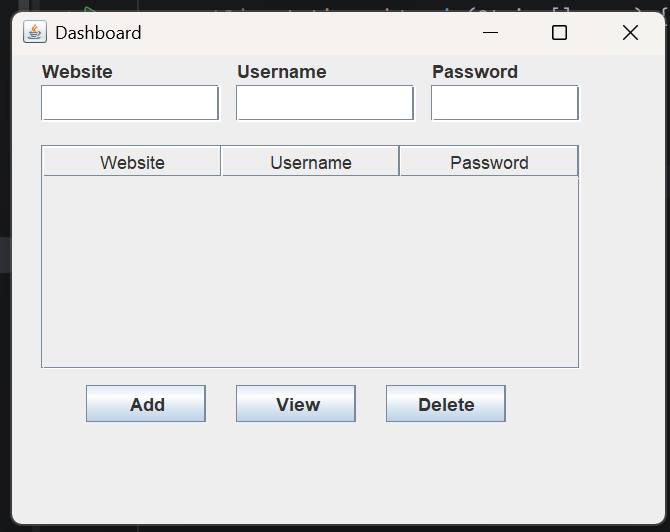
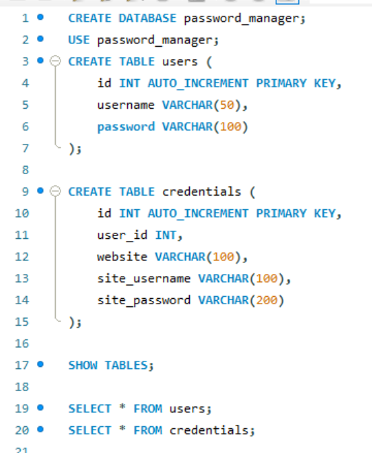

# 🔐 Secure Password Manager

A desktop-based Secure Password Manager developed using **Java Swing**, **MySQL**, and **JDBC**. The application enables users to securely store and manage website credentials through an intuitive graphical interface.

## 🚀 Features

- User Registration and Login Authentication
- Secure Credential Storage
- Add and Manage Website Credentials
- Password Encryption using Base64 Encoding
- MySQL Database Integration
- User-Friendly Java Swing GUI

## 🛠️ Technologies Used

- Java
- Java Swing
- MySQL
- JDBC
- Base64 Encryption
- IntelliJ IDEA

## 📂 Project Structure

```text
src/
├── com.passwordmanager
│   ├── dao
│   ├── main
│   ├── model
│   ├── ui
│   └── util
resources/
├── ProjectScreenshots/
docs/
```

## 📸 Screenshots

### Login Page


### Register Page


### Dashboard


### Database Schema


## ⚙️ Setup Instructions

### Prerequisites

- Java JDK 8 or higher
- MySQL Server
- IntelliJ IDEA (or any Java IDE)

### Database Setup

1. Create a MySQL database:

```sql
CREATE DATABASE password_manager;
```

2. Create the required tables:

```sql
CREATE TABLE users (
    id INT AUTO_INCREMENT PRIMARY KEY,
    username VARCHAR(50),
    password VARCHAR(100)
);

CREATE TABLE credentials (
    id INT AUTO_INCREMENT PRIMARY KEY,
    user_id INT,
    website VARCHAR(100),
    site_username VARCHAR(100),
    site_password VARCHAR(200)
);
```

3. Update database credentials in:

```java
DBConnection.java
```

```java
return DriverManager.getConnection(
    "jdbc:mysql://localhost:3306/password_manager",
    "YOUR_USERNAME",
    "YOUR_PASSWORD"
);
```

## 📖 Project Report

The detailed project report is available in:

```text
docs/Password_Manager_System_Report.pdf
```

## 🔮 Future Enhancements

- Stronger Encryption (AES)
- Password Generator
- Search and Filter Credentials
- Export Credentials Feature
- Password Strength Checker

## 👩‍💻 Author

**Shabnam Banu**

B.Tech CSE (Cyber Security)

GitHub: https://github.com/SabnamBanu

---

⭐ If you found this project useful, consider giving it a star!
